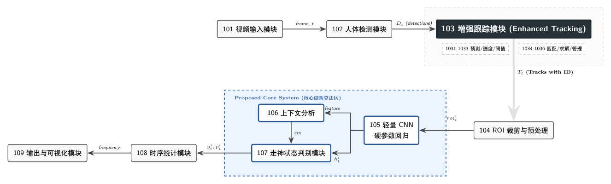

#课堂分心频率追踪器

一种针对边缘优化的双模态计算机视觉框架，用于在真实课堂环境中跟踪和量化学生的分心频率。

> **论文：** *Interpretable Classroom Distraction Estimation via Tracking-to-Analysis Continuity*（正在审稿中）

---

##系统演示

| Real-Time NRT Mode |离线批处理模式|
|---|---|
MJPEG流叠加每学生分心报告|
|P99头部延迟：322毫秒|吞吐量：**21.15帧/秒** |



---

##关键成果

###表1 — 主要定量比较

|方法|MOTA@0.3|IDF1@0.3|IDSW@0.3|MOTA@0.5|IDF1@0.5|F1|帧率|
|---|---|---|---|---|---|---|---|
| **我们的_完整** | **0.8928±0.075** | **0.9460±0.038** | **5.6±5.7** | **0.5995±0.198** | **0.7976±0.100** | **0.5427±0.054** | **21.15±3.49** |
| YOLOv8_ByteTrack | 0.8686±0.093 | 0.9315±0.052 | 13.7±5.6 | 0.6238±0.198 | 0.8031±0.108 | N/A | 83.19±9.33 |
| Fixed_IoU_0.5_E2E | 0.8888±0.074 | 0.9445±0.037 | 16.1±8.6 | 0.5981±0.197 | 0.7967±0.100 | 0.5386±0.055 | 27.17±5.42 |
| Fixed_IoU_0.3_E2E | 0.8904±0.074 | 0.9449±0.037 | 9.3±7.1 | 0.5987±0.197 | 0.7968±0.100 | 0.5399±0.054 | 25.92±4.19 |

### Table 2 — Scene-Level Breakdown

| Scene | #Videos | MOTA@Main | IDF1@Main | MOTA@Strict | IDF1@Strict | F1 | FPS |
|---|---|---|---|---|---|---|---|
| Scene A (class 1–5) | 5 | 0.9264±0.027 | 0.9630±0.013 | 0.7015±0.082 | 0.8497±0.039 | 0.5449±0.057 | 22.89±2.23 |
| Scene B (class 6–7) | 2 | 0.8086±0.072 | 0.9035±0.037 | 0.3447±0.100 | 0.6671±0.051 | 0.5372±0.026 | 16.80±0.44 |

### Table 3 — Ablation Study

| Setting | Combined Score | Dyn. Threshold | Context | F1 | FPS |
|---|---|---|---|---|---|
| Full_Model | ✓ | ✓ | ✓ | 0.5427±0.054 | 21.88±3.31 |
| No_Combined_Score | ✗ | ✓ | ✓ | 0.5426±0.054 | 24.15±2.83 |
| No_Dynamic_Threshold | ✓ | ✗ | ✓ | 0.5427±0.054 | 22.47±3.43 |
| No_Context | ✓ | ✓ | ✗ | 0.5416±0.054 | 24.25±4.58 |
| Basic_IoU_Only | ✗ | ✗ | ✗ | 0.5416±0.054 | 27.70±5.19 |

---

## Public Repository Scope

This lightweight public repository includes:

- the web/API shell under `backend/`
- the core tracking / context / temporal-statistics modules under `core/`
- the frontend reference page under `frontend/`
- the privacy-aware derived annotation package under `derived_release/`
- supplementary figures and tables under `submission_assets/`
- release-facing documentation such as `DATA_AVAILABILITY.md`, `MODEL_ACCESS.md`, `DATACARD.md`, and `RELEASES.md`

This public artifact does **not** include raw classroom videos, and local end-to-end inference also requires local model checkpoints and any runtime components expected by the backend configuration.

---

## Architecture

```
Video Stream
    │
    ▼
┌─────────────────┐
│  YOLOv8 Detector │  (person class only, det_interval=3)
└────────┬────────┘
         │ bounding boxes
         ▼
┌─────────────────────────────────┐
│       Enhanced Tracker           │
│  · Speed-adaptive dynamic IoU   │  τ(v) = max(τ_base − k·min(v,v_max), 0.15)
│  · Combined matching score Sij  │  Sij = 0.5·IoU + 0.3·dist + 0.2·size
│  · Two-stage trajectory recovery│
└────────┬────────────────────────┘
         │ tracked ROIs (with ID)
         ▼
┌─────────────────────────────┐
│  Lightweight CNN (21,475 params) │
│  Input: 224×224 ROI crop        │
│  Output: [nose_offset,          │
│           head_down_angle,      │
│           shoulder_diff]        │
└────────┬────────────────────┘
         │ hard parameters
         ▼
┌──────────────────────────────┐
│  Context Correction Module    │
│  Temporal majority voting     │
│  Boundary-aware smoothing     │
└────────┬─────────────────────┘
         │ per-frame state {Focused, Distracted}
         ▼
┌───────────────────────────┐
│  Temporal Statistics       │
│  WDR_t = (1/|V_t|)·Σ z_k  │
│  STR_i = (1/(T-1))·Σ 𝟙()  │
└────────┬──────────────────┘
         │
         ▼
   Per-student Report
   (distraction rate, transition freq, timeline)
```

---

## Dual-Mode Execution

| Mode | Throughput | P99 Latency | Use Case |
|---|---|---|---|
| Near Real-Time (NRT) | 9.64 FPS | 322 ms [298–392 ms] | Live classroom monitoring |
| Offline Batch | **21.15 FPS** | N/A | Post-class analysis |

---

## Quick Start

### 1. Install dependencies

```bash
pip install -r requirements.txt
```

### 2. Review model and data notes

Before attempting local inference, review:

- `MODEL_ACCESS.md`
- `DATA_AVAILABILITY.md`
- `DATACARD.md`

### 3. Start the backend server

```bash
python backend/manage.py runserver 0.0.0.0:8000
```

### 4. Open the frontend

Navigate to one of the following in your browser:

- `http://127.0.0.1:8000/`
- `http://127.0.0.1:8000/en/`

### 5. Public-artifact note for local runtime

This repository is structured as a lightweight public artifact. Full offline/NRT inference requires local availability of the model files referenced by `config.yaml` and any runtime components expected by `backend/api/views.py`.

If you only need the supplementary materials, no model weights are required for:

- `derived_release/`
- `submission_assets/`

### 6. (Optional) Inspect core modules standalone

```python
from core.tracker import EnhancedTracker
from core.classifier import LightweightCNNModel
from core.temporal_stats import compute_wdr, compute_str

tracker = EnhancedTracker(base_iou=0.3)
# ... see core/tracker.py for full usage
```

---

## Repository Structure

```
classroom-distraction-tracker/
├── derived_release/         # privacy-aware derived annotation package
├── submission_assets/       # supplementary figures and LaTeX tables
├── assets/                  # lightweight repository-facing figures
├── core/
│   ├── tracker.py          # Speed-adaptive dynamic IoU tracker
│   ├── classifier.py       # Lightweight CNN (21,475 params)
│   ├── temporal_stats.py   # WDR / STR temporal statistics
│   └── context.py          # Context correction module
├── backend/                # Django REST API + MJPEG streaming
│   ├── manage.py
│   ├── web_demo_backend/   # Django settings
│   └── api/
│       ├── urls.py         # API endpoints
│       └── views.py        # Request handlers
├── frontend/
│   └── index.html          # frontend reference page
├── config.yaml             # Hyperparameters
├── DATA_AVAILABILITY.md
├── MODEL_ACCESS.md
├── DATACARD.md
├── RELEASES.md
├── LICENSE
└── requirements.txt
```

> **Model note:** Pre-trained model weights are not included in this public repository. See `MODEL_ACCESS.md`.
>
> **Data note:** Raw classroom videos are not included. See `DATA_AVAILABILITY.md` and `DATACARD.md`.

---

## Supplemental Materials

- `derived_release/` provides the privacy-aware derived annotation package.
- `submission_assets/` provides supplementary figures and tables.
- `RELEASES.md` describes the recommended public release packaging.

---

## License

Code in this repository is released under the terms in `LICENSE`.

Data, model checkpoints, and supplemental artifacts may have additional redistribution constraints described in:

- `DATA_AVAILABILITY.md`
- `MODEL_ACCESS.md`

---

## Citation

```bibtex
@article{distraction2025,
  title   = {Edge-Optimized Dual-Mode Tracking-to-Analysis Pipeline for
             Robust Classroom Distraction Frequency Quantification},
  year    = {2025},
  note    = {Under Review}
}
```
