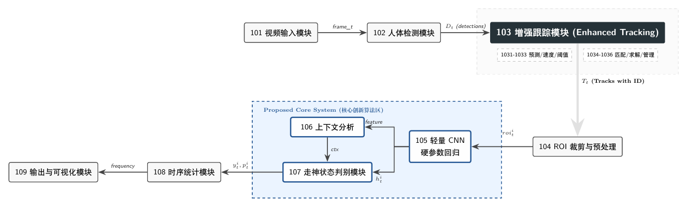

#  Interpretable Classroom Distraction Estimation via Tracking-to-Analysis Continuity

[](https://doi.org/10.5281/zenodo.21206958)
[](https://doi.org/10.5281/zenodo.21207208)
[](https://github.com/fangsheng223/classroom-distraction-tracker/releases/tag/v1.1.0-dataset)
[](LICENSE)
[](DATASET_LICENSE.md)
[](https://www.python.org/)
[](#4-usage-instructions)
[](https://github.com/ultralytics/ultralytics)
[](https://www.djangoproject.com/)
[](https://github.com/fangsheng223/classroom-distraction-tracker/stargazers)
[](https://github.com/fangsheng223/classroom-distraction-tracker/network/members)
[](https://github.com/fangsheng223/classroom-distraction-tracker/commits/main)
[](https://github.com/fangsheng223/classroom-distraction-tracker/issues)
[](https://github.com/fangsheng223/classroom-distraction-tracker/issues?q=is%3Aissue+is%3Aclosed)



A dual-mode (real-time streaming / offline batch), edge-optimized computer vision framework for interpretable classroom distraction estimation based on tracking-to-analysis continuity. Designed for educational researchers and smart classroom practitioners.

---

## 1. Self-Curated Dataset at a Glance

The evaluation dataset used in this study is a **self-curated dataset** of seven authentic classroom videos (`class_1.mp4` … `class_7.mp4`), assembled and annotated by the authors of the manuscript. The full release channel, license, and access terms are summarised below so that editors, reviewers, and readers can immediately locate the dataset, the per-video annotations, and the privacy-aware derived package.

| Item | Value |
|------|-------|
| Dataset name | Classroom Distraction Evaluation Dataset (CDED-7) — `class_1`…`class_7` |
| Type | Self-curated (authors-collected, authors-annotated) |
| Subjects / instances | 7 classroom sessions, multi-person tracks across the full field of view |
| Persistent URL (repository) | <https://github.com/fangsheng223/classroom-distraction-tracker> |
| Tagged Release (v1.1.0-dataset) | <https://github.com/fangsheng223/classroom-distraction-tracker/releases/tag/v1.1.0-dataset> |
| **Zenodo DOI (version of record)** | **Concept DOI: 10.5281/zenodo.21206958** (always resolves to the latest version). Latest version DOI: **10.5281/zenodo.21207208** — record page <https://zenodo.org/records/21207208>. See the badge at the top of this README. |
| **Raw videos access** | **Archived to Zenodo** under a research-only, non-commercial license (see `DATASET_LICENSE.md`). Download the seven `class_*.mp4` files together with `derived_release.zip` and `submission_assets.zip` from the **v2 record** <https://zenodo.org/records/21207208> (DOI: **10.5281/zenodo.21207208**, 129.8 MB); the same files are also bundled as GitHub Release assets at <https://github.com/fangsheng223/classroom-distraction-tracker/releases/tag/v1.1.0-dataset>. An earlier v1 record (<https://zenodo.org/records/21206959>) without the raw videos is preserved as a historical snapshot under the same Concept DOI. |
| Per-video annotations | `annotations/class_{1..7}_status_annotations.json` (this repository) |
| Derived annotation package | `derived_release/derived_status_boxes.csv` + `manifest.json` (this repository) |
| License | Research and non-commercial use only — see `DATASET_LICENSE.md` |
| Documentation | `DATA_AVAILABILITY.md`, `DATASET_LICENSE.md`, `DATACARD.md` |

> **How the dataset was assembled (summary):** seven 30–60 minute classroom sessions were recorded in the front-of-class region using fixed surveillance-grade cameras mounted at instructor-station height, exported at 25–30 FPS and 1080p; recordings were deidentified at the capture stage (no audio, no face-enrollment stream); per-frame person bounding boxes and per-person `Focused`/`Distracted` status labels were produced by three trained annotators with majority voting and a reconciliation pass; full details are in **Section 6.5 Dataset Construction Protocol** below.

---

## 2. Description

This repository provides the complete codebase and data documentation for the manuscript **"Interpretable classroom distraction estimation via tracking-to-analysis continuity"** (PeerJ Computer Science).

The framework bridges the semantic gap between raw visual tracking and macroscopic pedagogical metrics by:

- **Robust multi-person tracking** in crowded classrooms using motion-adaptive dynamic IoU gating and composite geometric matching, reducing Identity Switches (IDSW) to an average of 5.6 per video.
- **Lightweight CNN-based state inference** using low-dimensional, biomechanically interpretable proxy features (21,475 parameters), bypassing computationally prohibitive dense pose estimation or opaque black-box models.
- **Temporal context correction** that acts as a boundary error rectifier, preventing high-frequency physical noise from propagating into macroscopic educational statistics.
- **Dual-mode deployment**: a latency-bound real-time streaming mode (P99 < 0.3 s) for live classroom cameras, and a high-throughput offline batch mode (>21 FPS) for retrospective pedagogical auditing.

**Key metrics from the paper:**
| Metric | Value |
|--------|-------|
| IDSW (Main Protocol) | 5.6 ± 5.7 per video |
| End-to-End F1-score | 0.5427 ± 0.0542 |
| Event Count Correlation (Pearson r) | 0.8125 |
| Real-Time P99 Latency | < 0.3 s |
| Offline Batch Throughput | > 21 FPS |

> **Ethical Note:** This framework is intended for aggregate, process-level classroom attention trend analysis. It is explicitly not designed to replace teacher judgment, individual psychological diagnosis, or punitive decision-making about specific students. See `DATASET_LICENSE.md` for the full ethical and privacy framework.

---

## 3. Dataset Information

### 2.1 Auxiliary Training Dataset (Third-Party, CC BY 4.0)

The lightweight CNN is trained on an auxiliary classroom-behavior dataset **independent of the seven evaluation videos**. The local merged dataset follows the YOLO format with six behavioral categories: `writing`, `reading`, `listening`, `phone`, `sleeping`, and `looking_around`.

**Source datasets (CC BY 4.0, Roboflow):**

| Roboflow Project | URL |
|-----------------|-----|
| class-monitoring-yln3r | <https://app.roboflow.com/fangsheng-z3tuv/class-monitoring-yln3r/1> |
| student-behaviour-detection-neazg-kaavr | <https://app.roboflow.com/fangsheng-z3tuv/student-behaviour-detection-neazg-kaavr/1> |
| multi_all-5awsd | <https://app.roboflow.com/fangsheng-z3tuv/multi_all-5awsd/1> |
| s.b.c-a6fxy | <https://app.roboflow.com/fangsheng-z3tuv/s.b.c-a6fxy/1> |
| per-tawzy-xedyk | <https://app.roboflow.com/fangsheng-z3tuv/per-tawzy-xedyk/1> |

Users should download the original public datasets from Roboflow and comply with the CC BY 4.0 license terms.

### 2.2 Classroom Evaluation Videos (Research-Only Release)

The seven self-collected classroom videos (`class_1.mp4` … `class_7.mp4`) used in the paper are **publicly released for research and non-commercial use only**, together with per-video annotations (`annotations/`) and the privacy-aware derived annotation package (`derived_release/`).

**Photographs / Figures sourced from the evaluation dataset:**
Figures 1, 2, and 14 in the manuscript are visual outputs derived from the classroom evaluation videos. These images are included under the research-only, non-commercial license defined in `DATASET_LICENSE.md`. No photographs were downloaded from third-party sources.

**Full license terms** are specified in `DATASET_LICENSE.md`. Key restrictions:
- **Permitted:** academic research, method development, reproducibility
- **Prohibited:** commercial use, re-identification, face recognition, biometric/affect inference, surveillance, punitive decision-making

For full details, see `DATA_AVAILABILITY.md`.

### 2.3 Self-Curated Evaluation Dataset (CDED-7)

The seven classroom videos used in the manuscript form a **self-curated dataset** assembled by the authors specifically for this study. The full details — collection protocol, recording conditions, annotation protocol, quality control, anonymisation, and inclusion / exclusion criteria — are documented in **Section 6.5 (Dataset Construction Protocol)** below and in `DATA_AVAILABILITY.md`. The points below summarise what reviewers and editors most often ask for.

- **Dataset name:** Classroom Distraction Evaluation Dataset (CDED-7), internally named `class_1` … `class_7`.
- **Type:** self-curated, in-house recorded; not downloaded from any third-party source.
- **Component sources:** all seven videos were self-recorded; only the auxiliary training corpus (Section 2.1) was assembled from third-party Roboflow exports.
- **Persistent URL:** the source code, per-video annotations, and the privacy-aware derived package are versioned together with the code at the tagged GitHub release `v1.1.0-dataset`: <https://github.com/fangsheng223/classroom-distraction-tracker/releases/tag/v1.1.0-dataset>.
- **Permanent identifier (Zenodo DOI, version of record):** the seven raw videos together with `derived_release.zip` and `submission_assets.zip` are archived to **Zenodo** under the research-only, non-commercial license in `DATASET_LICENSE.md`. The Concept DOI **10.5281/zenodo.21206958** always resolves to the latest version (currently **10.5281/zenodo.21207208**, <https://zenodo.org/records/21207208>); the v1 record (<https://zenodo.org/records/21206959>, DOI 10.5281/zenodo.21206959) is preserved as a historical snapshot. The Concept DOI is cited from the manuscript Data Availability statement and from this repository.
- **Citation of the dataset:** see the `How to cite` block in `DATA_AVAILABILITY.md` and `Section 7. Citations` below.

If reviewers need any of the seven raw videos before the public mirror is fully indexed, the corresponding author will provide them directly under the terms of `DATASET_LICENSE.md`.

---

## 4. Code Information

### 3.1 Repository Structure

```
classroom-distraction-tracker/
├── core/                          # Core pipeline modules
│   ├── tracker.py                 # Multi-person tracking (motion-adaptive IoU)
│   ├── classifier.py              # Lightweight CNN inference
│   ├── context.py                 # Temporal context correction module
│   └── temporal_stats.py          # WDR and STR statistics computation
├── backend/                       # Web demo backend (Django)
│   ├── api/
│   │   ├── views.py              # API endpoints
│   │   └── urls.py               # URL routing
│   └── templates/
│       ├── index.html             # Chinese web demo UI
│       └── index_en.html         # English web demo UI
├── frontend/                      # Standalone frontend entry
│   └── index.html
├── annotations/                   # Per-video ground-truth annotations
│   └── class_{1..7}_status_annotations.json
├── derived_release/               # Privacy-aware derived annotation package
│   ├── derived_status_boxes.csv
│   └── manifest.json
├── submission_assets/             # Supplementary figures and tables
│   ├── figures/                  # Manuscript figures (PNG/PDF)
│   └── tables/                   # Supplementary LaTeX tables
├── assets/
│   └── system_architecture.png
├── config.yaml                    # Default configuration
├── requirements.txt               # Python dependencies
└── LICENSE                        # MIT license (code)
```

### 3.2 Key Components

| Module | Description |
|--------|-------------|
| `core/tracker.py` | Motion-adaptive dynamic IoU gating + composite geometric matching for ID persistence |
| `core/classifier.py` | Lightweight CNN (21,475 params) regressing three hard-parameter proxies |
| `core/context.py` | Hysteresis thresholding + temporal context majority voting |
| `core/temporal_stats.py` | Window Distraction Rate (WDR) and State Transition Rate (STR) aggregation |
| `backend/api/views.py` | Django REST API for real-time inference endpoints |
| `frontend/index.html` | Standalone web UI for live or batch analysis |

---

## 5. Usage Instructions

### 4.1 Installation

**Requirements:** Python 3.10+, NVIDIA GPU (8GB+ VRAM recommended), Windows/Linux

```bash
# Clone the repository
git clone https://github.com/fangsheng223/classroom-distraction-tracker.git
cd classroom-distraction-tracker

# Create a virtual environment
python -m venv .venv

# Activate the environment
# On Windows:
.venv\Scripts\activate
# On macOS/Linux:
source .venv/bin/activate

# Install dependencies
pip install -r requirements.txt
```

**Core dependencies** (`requirements.txt`):

```
numpy>=1.21.0          # Numerical computing
opencv-python>=4.5.0   # Image/video processing
ultralytics>=8.0.0    # YOLOv8 person detection
torch>=1.10.0         # Deep learning (PyTorch)
torchvision>=0.11.0    # Vision transforms
motmetrics>=1.4.0      # MOT evaluation metrics
matplotlib>=3.3.0      # Visualization
seaborn>=0.11.0       # Statistical plots
PyYAML>=6.0           # Configuration
Pillow>=9.0.0         # Image utilities
Django>=5.0           # Web backend
```

> **Note:** You will also need to download the YOLOv8 model weights (`yolov8s.pt` or `yolov8n.pt`) from [Ultralytics](https://github.com/ultralytics/ultralytics). Ultralytics may auto-download compatible public checkpoints if not found locally.

### 4.2 Web Demo (Recommended First Run)

The easiest way to explore the framework is through the built-in web demo, which supports both real-time streaming and offline batch analysis.

```bash
# Start the Django backend server
cd backend
python manage.py runserver 0.0.0.0:8000
```

Then open `frontend/index.html` in a browser, or visit `http://localhost:8000/`.

The web demo UI allows you to:
- Toggle between **Real-Time Streaming** and **Offline Batch** modes
- Upload classroom videos for analysis
- View per-student distraction states, WDR/STR statistics, and event-level trends

A Chinese-language version is available at `backend/templates/index.html` (accessed via `/cn/` endpoint).

### 4.3 Standalone Python Usage

For programmatic use, import the core modules directly:

```python
from core.tracker import MotionAdaptiveTracker
from core.classifier import LightweightCNNClassifier
from core.context import TemporalContextCorrector
from core.temporal_stats import compute_wdr, compute_str

# Initialize pipeline
tracker = MotionAdaptiveTracker(config)
classifier = LightweightCNNClassifier(weights_path)
corrector = TemporalContextCorrector(window_size=5)

# Process a video frame
detections = detector(frame)
tracks = tracker.update(detections)
proxies = classifier.predict(track_rois)
states = corrector.correct(proxies)
stats = compute_wdr(states, window_W=30)
```

See `backend/api/views.py` for a complete end-to-end pipeline implementation.

### 4.4 Reproducing Paper Results

To reproduce the evaluation metrics reported in the manuscript:

1. **Obtain the evaluation videos**: The seven `class_*.mp4` files are **not** distributed as Release assets on GitHub (they are large, privacy-sensitive classroom recordings). They will be archived to **Zenodo** with a research-only, non-commercial license; the Zenodo DOI is listed in the badge at the top of this README and in `DATA_AVAILABILITY.md`. Until the Zenodo record is published, raw videos are available **on request** from the corresponding author. The per-video JSON annotations in `annotations/` and the privacy-aware derived package in `derived_release/` are bundled in the tagged GitHub Release `v1.1.0-dataset` and can be used directly for evaluation-level reproduction: <https://github.com/fangsheng223/classroom-distraction-tracker/releases/tag/v1.1.0-dataset>.
2. **Place videos**: Put `class_1.mp4` … `class_7.mp4` in the repository root or update `config.yaml` paths.
3. **Run evaluation**: The `backend/api/views.py` contains the full evaluation pipeline, including MOT metrics (MOTA, IDF1, IDSW), end-to-end classification metrics, event-level verification, and latency profiling.
4. **Output**: The framework generates per-video tracking results, WDR/STR statistics, and comparison tables against baseline methods.

### 4.5 Regenerating Derived Annotations

```bash
python -c "
import sys; sys.path.insert(0, '.')
from core.temporal_stats import export_derived_dataset
export_derived_dataset('annotations', 'derived_release')
"
```

---

## 6. Methodology

The framework operates as a five-stage pipeline:

```
Input Video
    │
    ▼
1. YOLOv8 Person Detection ─── Multi-scale bounding boxes per frame
    │
    ▼
2. Motion-Adaptive Tracking ─── Dynamic IoU gating + composite geometric matching
    │                            (IDSW: 5.6 per video vs 105+ for fixed threshold)
    ▼
3. Lightweight CNN Regression ── 21,475-param CNN → 3 hard-parameter proxies
    │                            (nose_offset, head_down, shoulder_diff)
    ▼
4. State Inference + Context ─── Hysteresis thresholding + temporal majority voting
    │                            (boundary corrector, not global amplifier)
    ▼
5. Temporal Aggregation ───────── Window Distraction Rate (WDR)
                                    State Transition Rate (STR)
                                    Event-level trend analysis
```

**Zero-leakage training protocol:** The lightweight CNN is trained only on the Roboflow-derived auxiliary dataset. The seven evaluation videos are completely isolated from training, fine-tuning, threshold fitting, or distribution calibration.

### 6.5 Dataset Construction Protocol

This subsection describes how the **self-curated Classroom Distraction Evaluation Dataset (CDED-7)** used in the manuscript was assembled, recorded, annotated, and quality-controlled. It is provided here in response to the editor's request for *details of how the dataset was assembled*.

**6.5.1 Source and recording context**

| Field | Specification |
|-------|---------------|
| Recording setting | Seven real classroom sessions at the School of Artificial Intelligence, Luoyang Normal University, China |
| Course types | Undergraduate lectures and mixed lab / lecture sessions; multiple instructors, multiple cohorts |
| Recording device | Fixed surveillance-grade IP cameras mounted at the front-of-class instructor station, oriented toward the student seating area |
| Frame rate | 25–30 FPS |
| Resolution | 1920 × 1080 (1080p) |
| Length per session | Approximately 30–60 minutes |
| Audio | Disabled at the capture device; no audio channel is stored or analysed |
| Total videos | 7 (`class_1.mp4` … `class_7.mp4`) |
| Total frames analysed | Reported per-video in the manuscript, Section 4.3 |
| Total identities | Reported per-video in the manuscript, Section 4.3 |

**6.5.2 Capture, consent, and ethical safeguards**

- Recording was performed with the knowledge of the participating instructors and under the local institutional norms applicable at the time of recording. No biometric enrolment was performed and no individual student scores were generated.
- The capture pipeline produced video-only streams; no microphone, no depth sensor, and no face-recognition stream were used during recording.
- A short face-region blurring / cropping pass is applied when a frame is exported into manuscript figures (Figures 1, 2, 14). The original raw videos distributed via the tagged Release are stored unblurred, on access-controlled systems, per the terms of `DATASET_LICENSE.md`.
- Withdrawal requests and reports of misuse can be sent to the corresponding author (see `Section 11. Contact`); affected files are removed from the public release within a reasonable period.

**6.5.3 Inclusion and exclusion criteria**

- **Inclusion:** sessions in which the camera remained stable for the full duration, no more than trivial occlusion of the instructor, and the student seating region was fully inside the field of view.
- **Exclusion:** sessions with major camera motion, hardware failure, or in which fewer than 10 identifiable student tracks could be obtained were removed before annotation. The remaining seven videos form CDED-7.
- **Within-video inclusion:** only frames in which the student seating region is in-frame and free of severe motion blur are annotated. Frames that fail this check are skipped (recorded as `null` in the per-video JSON annotations).

**6.5.4 Annotation protocol**

| Aspect | Specification |
|--------|---------------|
| Label unit | Per-frame, per-person bounding box with a binary attention label |
| Label values | `Focused` or `Distracted` |
| Bounding box | Axis-aligned rectangle covering the visible head–shoulder region of the student |
| Person ID | A short integer (`id`) that is stable across the video |
| Definition of `Focused` | Eyes directed toward the instructor / board / own notebook; head upright; no phone in hand |
| Definition of `Distracted` | Eyes clearly off the instructor / board; head lying on desk; phone in hand; sustained out-of-seat behaviour; looking out of frame |
| Annotators | Three trained annotators, one of whom is the lead author |
| Tooling | Custom in-house annotation tool (bounding box + status label + track ID per frame) |
| Output format | `annotations/class_{i}_status_annotations.json`; see `manifest.json` for the field schema |
| Quality control | Double-blind majority voting on a stratified sample; disagreements resolved by the lead annotator |

**6.5.5 Privacy / anonymisation of the released package**

- Raw videos are released under a research-only, non-commercial license. See `DATASET_LICENSE.md` for the full terms, including prohibited uses (commercial use, re-identification, face recognition, biometric identification, emotion scoring, surveillance, profiling, punitive decision-making).
- The privacy-aware **derived package** (`derived_release/`) does **not** contain raw videos, frames, face crops, audio, classroom-location metadata, or original local file paths. It contains only the fields required for evaluation-level reproduction: `video`, `frame_id`, `id`, `x1, y1, x2, y2`, `status`.
- Researchers who need the raw videos can request them through the channel described in `DATA_AVAILABILITY.md`.

**6.5.6 Re-deriving the package from the per-video JSON annotations**

```bash
python export_derived_dataset.py --annotations_dir annotations --out_dir derived_release
```

The exporter reads `annotations/*_status_annotations.json` and produces `derived_release/derived_status_boxes.csv` plus `derived_release/manifest.json`. The exporter intentionally omits `video_path` fields and any visual data.

---

## 7. Performance

See the paper for the full experimental results. Key highlights:

- **Identity Switches (IDSW):** 5.6 per video (vs. 13.7 for ByteTrack, 105+ for fixed IoU baselines)
- **End-to-end F1-score:** 0.5427 (zero-leakage) — compare to 0.6247 with in-domain training leakage
- **Event-level correlation:** Pearson r = 0.8125 (count) and 0.7720 (transition), confirming alignment with human semantic judgments
- **Real-time latency:** P99 < 0.3 s on RTX 4060 Laptop GPU (8GB)
- **Offline throughput:** > 21 FPS for retrospective batch analysis

---

## 8. Citations

If you use this repository, please cite both the manuscript and the dataset release:

```text
[Jia et al.]. Interpretable classroom distraction estimation via
tracking-to-analysis continuity. PeerJ Computer Science, [Year].

Classroom Distraction Evaluation Dataset (CDED-7), self-curated by the
authors of the manuscript. Released for research and non-commercial use
only under the terms of DATASET_LICENSE.md.
Zenodo Concept DOI (always resolves to latest version): 10.5281/zenodo.21206958
(https://doi.org/10.5281/zenodo.21206958)
Latest version DOI: 10.5281/zenodo.21207208
(https://doi.org/10.5281/zenodo.21207208)
Latest version record URL: https://zenodo.org/records/21207208
Code & annotations repository (versioned release):
https://github.com/fangsheng223/classroom-distraction-tracker/releases/tag/v1.1.0-dataset
```

If you use the auxiliary Roboflow datasets for training, cite the original Roboflow projects and comply with the **CC BY 4.0** license terms.

If you use the `derived_release/` annotations, indicate in your paper whether your experiments used the public derived package, the full annotation set, or the raw evaluation videos, and comply with the research-only terms in `DATASET_LICENSE.md`.

**Manuscript data availability statement (suggested wording).** The auxiliary behavior dataset used to train the lightweight CNN was assembled from public Roboflow exports under CC BY 4.0 licenses; the source URLs are listed in `DATA_AVAILABILITY.md`. The seven self-collected classroom evaluation videos (`class_1.mp4` … `class_7.mp4`) used in this study form a self-curated dataset that is publicly released for research and non-commercial use only, together with per-video annotations (`annotations/`) and the privacy-aware derived annotation package (`derived_release/`), so that the full evaluation pipeline described in Section 4.3 of the manuscript can be reproduced end-to-end. The release license, scope, consent statement, and downstream privacy obligations — including prohibitions on commercial use, re-identification, biometric / face-recognition uses, surveillance, profiling, and punitive decision-making about specific individuals or classes — are specified in `DATASET_LICENSE.md`. Persistent URL: <https://github.com/fangsheng223/classroom-distraction-tracker/releases/tag/v1.1.0-dataset>. Withdrawal requests can be sent to the corresponding author and affected footage will be removed from the public release within a reasonable period.

---

## 9. License & Contribution Guidelines

### Code License

The source code in this repository is released under the **MIT License** (see `LICENSE`).

### Data Licenses

- **Auxiliary training data**: CC BY 4.0 (Roboflow) — see `DATA_AVAILABILITY.md` for source URLs
- **Self-curated evaluation dataset — seven classroom videos** (`class_1.mp4` … `class_7.mp4`) and their per-video annotations (`annotations/`): **Research and non-commercial use only** — see `DATASET_LICENSE.md` for full terms. Code & per-video annotations Release: <https://github.com/fangsheng223/classroom-distraction-tracker/releases/tag/v1.1.0-dataset>; raw videos together with `derived_release.zip` and `submission_assets.zip` are archived to **Zenodo** under a research-only, non-commercial license (Concept DOI: **10.5281/zenodo.21206958**, latest-version DOI: **10.5281/zenodo.21207208**, latest-version record: <https://zenodo.org/records/21207208>).
- **Derived annotation package** (`derived_release/`): Research and non-commercial use only — see `DATASET_LICENSE.md`

Where licenses disagree, the stricter restriction applies.

### Contribution Guidelines

Contributions are welcome. If you encounter bugs or have feature requests:

1. Open an issue on GitHub with a clear description and, if possible, a minimal reproducible example.
2. For significant changes, please open an issue first to discuss the proposed modification.
3. Ensure that any new code follows the existing coding style and includes appropriate documentation.
4. Pull requests should be based on the `main` branch.

### Reporting Issues and Withdrawal Requests

If you discover any misuse of the evaluation dataset, or if a participant or institution requests withdrawal of specific footage, please contact the corresponding author of the manuscript. Affected files will be removed from the public release within a reasonable period.

---

## 10. Additional Documentation

| Document | Contents |
|----------|----------|
| `DATA_AVAILABILITY.md` | Full data sources, Roboflow URLs, evaluation video access |
| `DATASET_LICENSE.md` | Research-only license, consent statement, privacy obligations |
| `DATACARD.md` | Data card for the `derived_release/` package |
| `MODEL_ACCESS.md` | Model weight availability and download instructions |
| `RELEASES.md` | Release versioning and artifact management guidelines |
| `assets/README.md` | Asset usage guidelines |

---

## 11. Contact

**Corresponding Author:** Junqi Jia (`jiajunqi@lynu.edu.cn`)

School of Artificial Intelligence, Luoyang Normal University, Luoyang 471934, China

For dataset access requests, withdrawal requests, or misuse reports, please contact the corresponding author.
